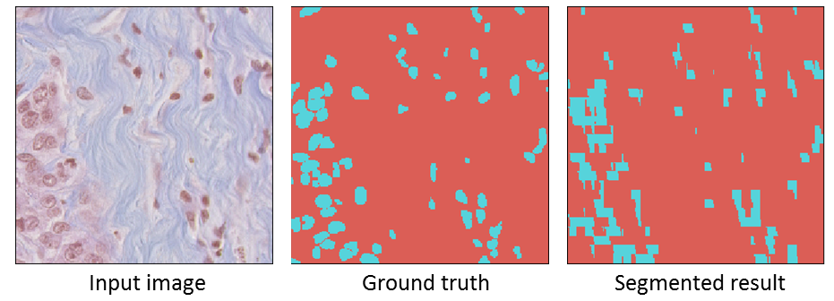
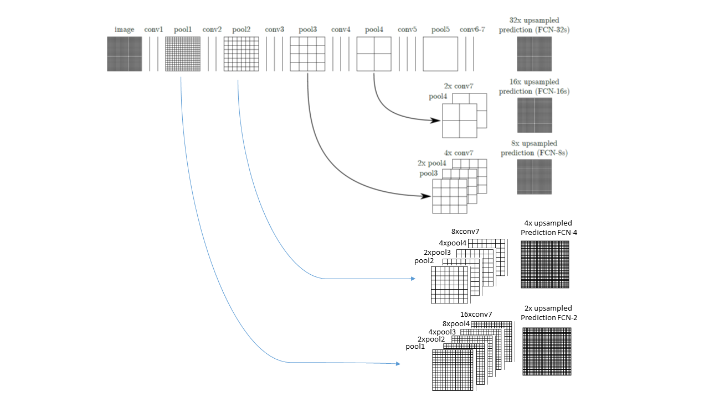
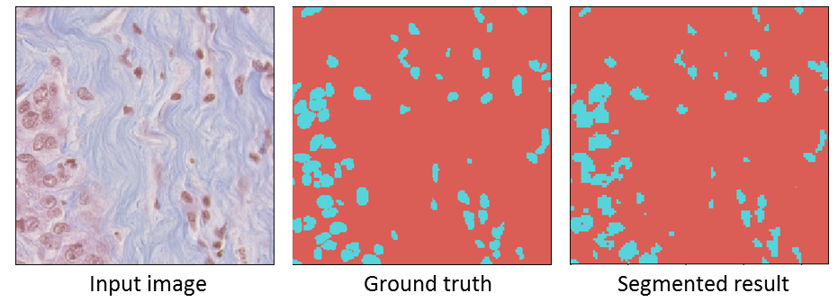
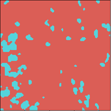
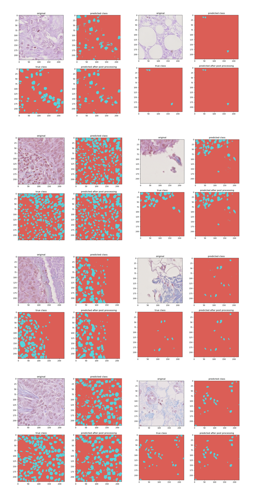

# FCN-Segmentation
To segment cell nuclei from histology images, I decided to use Fully Convolutional networks. I had experiences in medical images segmentation but a deep learning based approach was new to me! So, I decided to start with a basic DL based segmentation and I found FCN easy and straightforward for the task.  
During the implementation, I used the material and explanations provided in the following webpage:
https://fairyonice.github.io/Learn-about-Fully-Convolutional-Networks-for-semantic-segmentation.html  
In order to train and test the models faster I used a smaller subset of the provided data in development phase, which 6 images used for training and 1 for validation. This subset used for tune the DL parameters.  
My first attempt using FCN-8 [1] wasn’t much promising. The final segmented region is shown bellow. Left shows the input image, right is the segmented image, and the ground truth is shown in the middle.
 

I realized the pixelated effect that happens in the segmented region is mostly due to the up-sampling with factor of 8 occurring using the inverse convolution layer. So, I thought maybe using skip connections after finer resolutions (i.e., first and second pooling layers), might help to preserve the details in the boundary of the objects. So, the second attempt was to include these connections to the original FCN-8 as shown below.

As can be seen the up-sampling is done by a factor of 2 instead of 8. This network provided much better performance by preserving the details in the object boundary. The result on the same testing sample is as follow

By observing the holes inside the objects and very small segmented area as foreground, I decided to use morphological Opening and Closing operations to fill in inside objects and get rid of these small areas. So, as a simple post-processing step I applied the Closing and Opening to the obtained result from the network. Also, since objects of interests are mostly circular, I chose to use circular structure elements for the morphological operations, and the final segmented region is as follow: 
 
For the final evaluation I used all the samples and divide it into two groups. 80% for training (41 samples) and 20% for validation (9 samples). Having more time, a k-fold-cross-validation should be considered for the performance evaluation. I used the dice similarity coefficient to report the performance. The following figures shows the final segmented regions obtained for 8 samples of testing set, with a total **DSC=0.756**.

