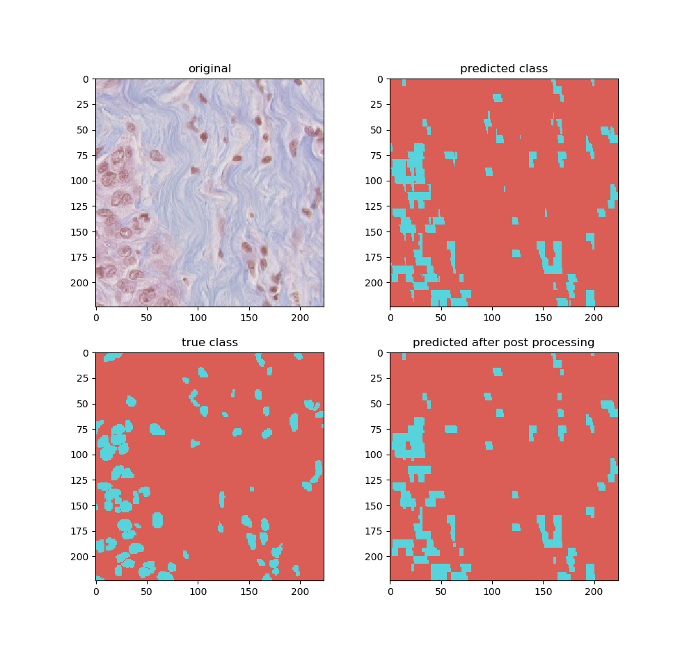

# FCN-Segmentation
To segment cell nuclei from histology images, I decided to use Fully Convolutional networks. I had experiences in medical images segmentation but a deep learning based approach was new to me! So, I decided to start with a basic DL based segmentation and I found FCN easy and straightforward for the task.  
During the implementation, I used the material and explanations provided in the following webpage:
https://fairyonice.github.io/Learn-about-Fully-Convolutional-Networks-for-semantic-segmentation.html
In order to train and test the models faster I used a smaller subset of the provided data in development phase, which 6 images used for training and 1 for validation. This subset used for tune the DL parameters.  
My first attempt using FCN-8 [1] wasn’t much promising. The final segmented region is shown bellow. 

I realized the pixelated effect that happens in the segmented region is mostly due to the up-sampling with factor of 8 occurring using the inverse convolution layer. So, I thought maybe using skip connections after finer resolutions (i.e., first and second pooling layers), might help to preserve the details in the boundary of the objects.
